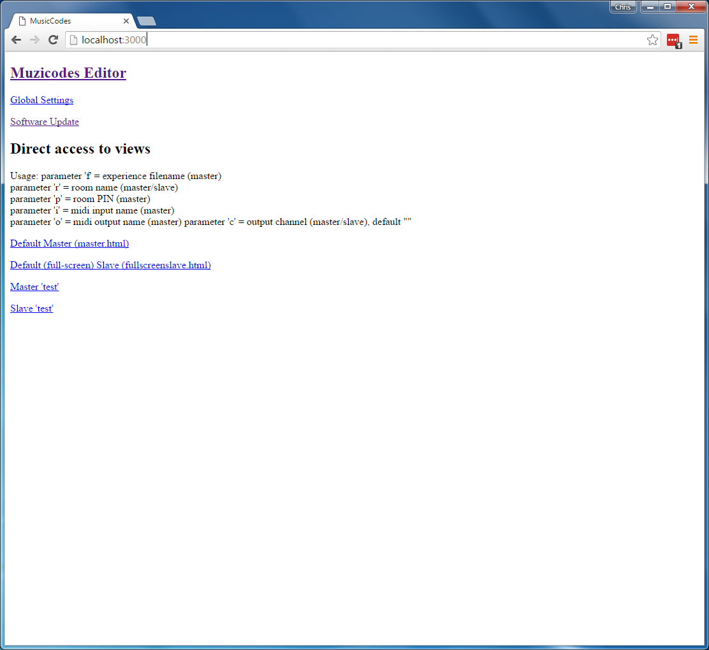
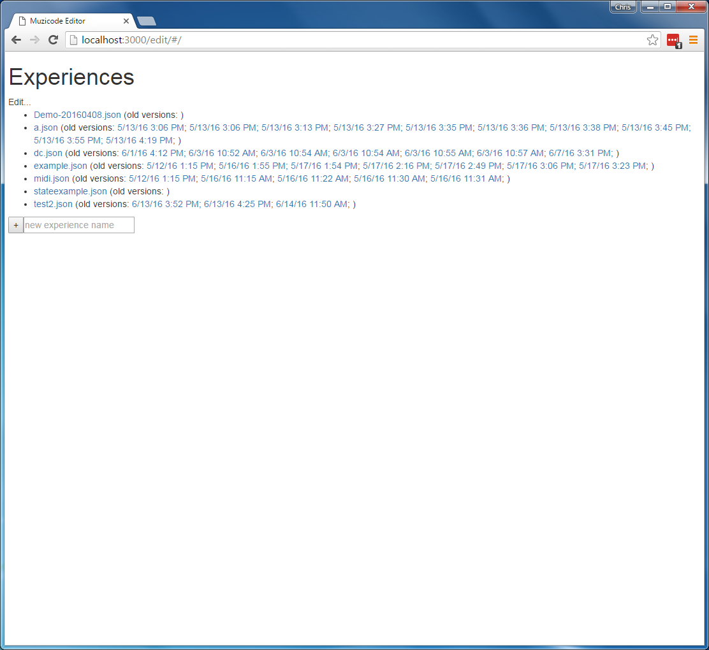
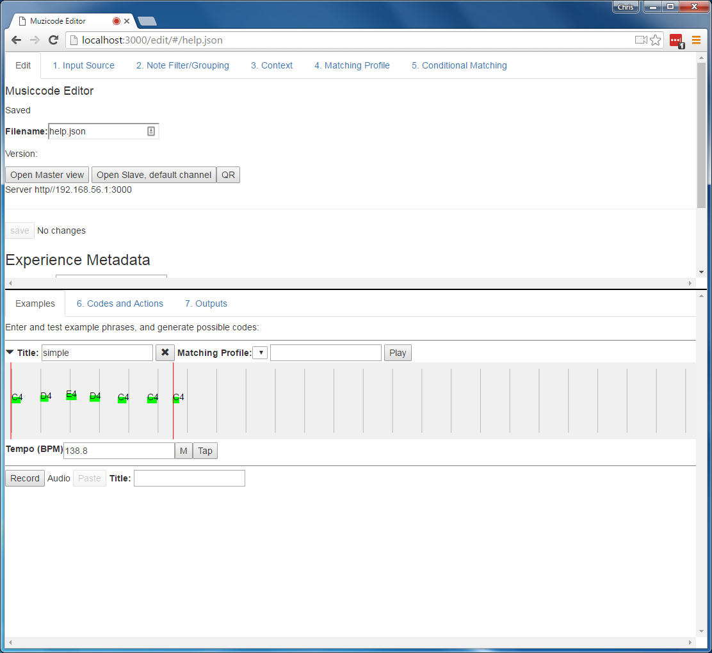
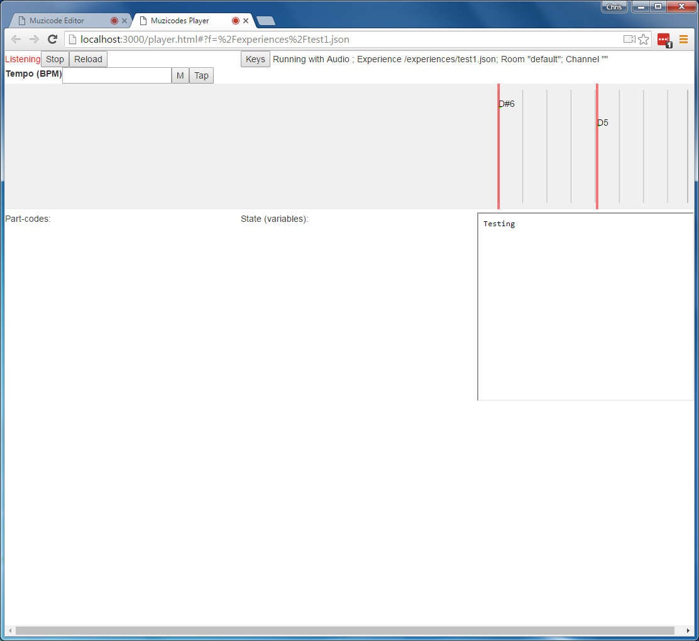

# Muzicodes User Guide

Version 2, 2016-06-14

Contents:
- overview
- quickstart
- editor
- player
- codes
- actions

## Overview

The muzicodes system works as follows:

1. Raw notes are input from a selected MIDI input or from the default audio input. Each note has a pitch (frequency), volume (velocity) and onset (start) time; muzicodes does not use the note's duration.
1. Raw notes are filtered, e.g. to include only notes in a particular pitch (frequency range) or with a certain volume (velocity).
1. Filtered notes are grouped into sequences of notes, based on the gaps (delays) between the notes.
1. Based on the musical context (currently tempo) each group of notes is translated into a sequence of notes and delays between notes (e.g. "C4" for middle-C, "/1" for one beat).
1. Groups of notes are then matched against the defined codes (patterns), according to a specified matching profile. The matching profile specifies how delays (and pitches) are quantised, and for inexact matching specifies the specific "costs" or "errors" associated with differences between notes and codes.
1. When a code is matched the associated actions are performed, e.g. loading a URL or sending a MIDI message.

## Quickstart

1. Open the home page, [http://localhost:3000/](http://localhost:3000/)
1. Click `Muzicodes Editor` to see the list of experiences.
1. Create a new experience by typing the name and pressing `+`
1. In the `1. Input Source` tab (top panel) select the MIDI input you are using or the audio instrument, as appropriate.
1. In the `4. Matching Profile` tab (top panel) create an initial matching profile, title "1", beat quantisation 1 and pitch quantisation 1 and press `+`
1. In the `Examples` tab (bottom panel) press `Record`, play a short phrase and press `Stop`. Give it a title and press `Done`. Specify the "Matching profile" as "1" (created above). 
1. In the `2. Note Filter/grouping` tab (top panel) set minimum and/or maximum frequencies and velocities if your example includes spurious notes such as overtones.
1. Select and copy the code from the example (on the right of the "Matching profile")
1. In the `6. Codes and Actions` tab (bottom panel), select the same matching profile and paste in the code from the example (on the right) and press `+`. 
1. Once the code has been added check `inexact`, `at start` and/or `at end` to control how it will be matched.
1. To add an action, enter a `URL`, e.g. "data:text/plain,Hello" and press `+` next to that.
1. In the `Edit` tab (top panel), press `Save` to save the experience.
1. In the `Edit` tab press `Open master view` to open the player view.
1. Try playing the same musical phrase and check that the code is progressively matched (bottom left) and when it is fully matched the URL is loaded (bottom right).

The various parts of the interface are described briefly below.

## Home page

The home page is typically access as URL [http://localhost:3000/](http://localhost:3000/).

Click `Muzicodes Editor` to open the editor view - see below.

Click `Software update` to change your version of muzicodes. Keep a note of your current "Commit" in case you need to return to this version. Enter the new version (commit ID) and press `Update`. This may take a minute or two to update - be patient.

## Editor

### Experience List

The initial editor view is a list of local experiences. Select one in order to edit or use it (see below), or enter a new experience name and press `+` to create a new blank experience.

### Experience View

The experience editor view is divided into an upper panel for settings and a lower panel for examples and codes. Each panel is subdivided with tabs, reflecting different elements of the experience.

#### Edit tab (upper panel)

To save the current experience press `Save` in the upper `Edit` tab. 

To use an experience press `Open Master view` in the upper `Edit` tab; the "player" interface will open in a new browser window - see below.

In this tab you can also give the experience a title, description and author.

#### 1. Input Source tab (upper panel)

If using MIDI as input select the input source (`Use Midi input`); the drop-down list will include available MIDI inputs. Note: you may need to quit and restart the browser if you change the MIDI devices.

Leave the MIDI input blank to use audio input. When using audio, use the `Instrument` drop-down to specify the instrument you are using to get better note recognition. 

#### Examples tab (lower panel)

Press `Record` to record an example muzicode or phrase. Press `Stop` at the end of the phrase. Give the example a title and press `Done`. 

Notes are shown as a pitch name (e.g. "C4") and a rectangle, which is green for notes which are being used and grey for notes which are filtered out by the current note filter settings.

Groups of notes are highlighted in a red box.

Once an example has been recorded you can modify its context; currently this is tempo only. 

You can also specify a "Matching profile" in which case the corresponding code will be displayed, which can be copied via the clipboard.

#### 2. Note filter/Grouping tab (upper panel)

Specify which notes will be used and which will be ignored based on their frequency (minimum and maximum) and velocity (i.e. volume). Note that the examples will update dynamically as these values are changed.

Specify when one group will end and another will begin with the "maximum gap between notes". 

#### 3. Context tab (upper panel)

Specify the musical context for interpreting notes, currently only tempo. The `M` button is a visual metronome; tap the `Tap` buttom in time with the music as another way to set the tempo.

Alternatively leave it at 60 BPM so that 1 beat = 1 second.

#### 4. Matching Profile tab (upper panel)

You must add at least one matching profile. For example, set title "1", beat quantisation "1" and pitch quantisation "1" and press `+`. This matching profile will round all delays to the nearest beat and all notes to the nearest semitone. 

If you use inexact matching in a code then the other parameters specify exactly how the inexact matching will work:
- `note insert cost` (number, default 1) weight given to note insertion errors, i.e. extra notes not in the code
- `note delete cost` (number, default 1) weight given to note deletion errors, i.e. missing a note in the code
- `note replace cost` (number, default 2) weight given to note replacement errors, i.e. a different note to the one in the code (which will never be more than an insert plus a delete)
- `note allow variation` (number, semitones, default 0) allowed difference between actual and code midinote value (1=one semitone)
- `note max variation` (number, semitones, default 0) difference between actual and code midinote value beyond which a full error penalty is applied. E.g. `note allow variation` 1 and `note max variation` 3 would assign an error of 0 to same note or +/-1 semitone, error of 0.5 to +/-2 semitones, and error of 1 to +/-3 semitones or above.

- `delay cost` (number, default 1) weight given to delay errors vs note errors (default for all note errors is 1)
- `delay allow variation` (number, beats, default 0) allowed difference between actual and code delay value (1=one beat)
- `delay max variation` (number, beats, default 0) difference between actual and code delay value beyond which a full error penalty is applied (1=one beat)
- `tempo allow variation` (number, ratio - fraction of tempo, default 0) allowed fraction by which delays may differ compared to context-defined tempo. E.g. 0.1 implies actual delays may be 1/1.1 (90.9%) - 1.1/1 (110%) of code delays.
- `tempo max variation` (number, ratio - fraction of tempo, default 0) fraction by which delays may differ compared to context-defined tempo beyond which a full error penalty is applied. 

#### 5. Conditional Matching tab (upper panel)

You can specify additional rules about when codes will be matched using "variables" or "state" within the experience. Select the checkbox `Show states in codes` to make this visible in the Codes tab.

This require basic knowledge of Javascript expressions. 

For example, add an initial state variable `count` = `0`. Check the checkbox `Show states in codes`. Go to a code. Specify a precondition for that code such as `count<4` so that the code will only be matched if `count` is less than 4. specify a post state for count = `count+1` so that 1 is added to count each time the code is matched. The code would now only be matched 4 times in one experience.

#### 6. Codes and Actions tab (lower panel)

To add a new code, enter a title for it, select a Matching Profile, enter a code pattern and press `+`. 

Initial patterns can be copied from an example or typed in directly. See the description of codes, below.

Once a code has been added you can also specify:
- it must be at the start of a group of notes
- it must be at the end of a group of notes 
- it can be matched inexactly
- and if so with how much "error"

The `Matches:` line will show the title(s) of all of the examples that are currently matched by the code, together with the associated error value.

To add an action enter a URL and press `+`. Leave the "channel" blank to use the default channel (destination) for the action. See description of actions, below.

#### 7. Outputs tab (lower panel)

To specify the MIDI output device to use for MIDI actions use the MIDI Output dropdown.

Other output options will be added as more types of outputs are supported.

## Player (Master)

The player read notes from the default audio input or the MIDI input specified in the experience, filters these notes, ignoring any which are (e.g. too high or too low according to the experience), applies the current context to those notes (e.g. to convert times in seconds to beats), groups these notes in sequences, and attempts to match them against the codes in the experience. When a match is found the corresponding action is performed (e.g. loading a URL).

The player view has 6 parts:

- A status line, with controls to `Stop` the player or `Reload` it (if the experience is changed in the editor). The `Keys` button opens a small virtual keyboard at the bottom of the page for testing.

- A "context" line, which currently just allows the tempo to be set. The `M` button is a visual metronome; tap the `Tap` buttom in time with the music as another way to set the tempo.

- A piano-roll style view of the notes being detected by the player. Notes are shown as note names and blocks, green for notes that are being considered for codes and grey for notes that are being filtered out. Red boxes show sequences (groups) of notes that are being considered as possible codes. You can copy notes from the piano-roll into the editor by selecting them (main mouse button), switching to the editor and pressing `Paste` (next to `Record`) at the bottom of the lower `Examples` tab.

- A "part-codes" area (bottom left) which gives visual feedback on the code in the experience and how much they have been matched by the current note sequence.

- A "State" area (bottom, middle) which shows the current values of any variables (state) used in the experience for conditional interaction.

- An output area (bottom, right) which shows the most recent URL triggered on the default channel.

## Codes

For version 2, a code is based on a regular expression, but with notes and delays as the 'alphabet' rather than individual characters.

Atomic terms are:
- note: as note name and (optional) octave number. E.g. "C4" is midi note 60, middle C. The default octave is 4.
- delay: as "/" and number of beats (floating point, approximate). E.g. "/1" is a 1-beat pause between notes.

Basic range terms are:
- note range: minimum note and maximum note, default any note. Syntax is '[' note '-' note ']', e.g. "[C4-]" is any note middle-C or above.
- delay range: minimum delay and maximum delay, default any delay. Syntax is '/[' delay '-' delay ']' or '[/' delay '-' '/'? delay ']', e.g. "/[0.5-2]" is any delay between 0.5 and 2 beats.

Wildcard, ".", is any note or delay (but only one).

Basic compound terms are:
- group: wraps any term as a single unit, e.g. "(C4,D4)" - only needed to deal with precedence of other operators.
- sequence: of terms in order, separated by ",". E.g. "C4,/1,D4" is middle-C, 1 beat delay, D above middle-C.
- choice: of terms, unordered, separated by "|". E.g. "C4|D4" is middle-C or D above middle-C.

Precedence of "|" is lowest, i.e. 'a,b|c,d' is equivalent to '(a,b)|(c,d)'.
Note: for inexact matching a choice can only include individual notes, delays or ranges. For example "(A4|B4),C4" is OK, but "(A4,B4)|(B4,C4)" is not.

Quantifier (repeats) terms are all suffix operators:
- "?", for optional. E.g. "C4?" is either middle-C or nothing (i.e. 0 or 1 repetitions)
- "\*", for kleene star, i.e. any number of repetitions including 0. E.g. "C4\*" or ".\*"
- "+", for at least once. 
- "{" m "-" n "}" for between m and n repetitions, inclusive. E.g. "C4{0-1}" is equilent to "C4?"

Precedence of quantifiers is more than sequence or choice. E.g. "C4,D4+" is middle-C followed by at least one D4
Note: for inexact matching  "?" (equivalently "{0-1}"), "\*"  (equivalently "{0-}"), and  "+" (equivalently "{1-}") are supported, but other ranges are not (i.e. m > 1, or n >1 but not unlimited).

The regular expression beginning/end markers ("^" and "$") are not used; the marker properties "atStart" and "atEnd" specify whether the pattern match must be at the start/end of the note group, respectively.

## Actions

Actions are URLs. By default they are loaded into an iframe when triggered.

Note that simple text can be encoded using data URIs, e.g. `data:text/plain,hello`. Strictly these should be %-escaped for all characters other than letters and digits.

### Midi actions

A data URI with the non-standard MIME type `text/x-midi-hex` will be output to the current MIDI output channel (if any). All bytes are output immediately. Each byte is encoded as two hex digits. E.g. `data:text/x-midi-hex,903a7f` is note on, middle C, max velocity.
